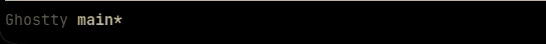

# tui-shimmer

Shimmer text effect for terminal UIs built with ratatui.



## Usage

```rust
use ratatui::style::Style;
use tui_shimmer::shimmer_spans_with_style;

let spans = shimmer_spans_with_style("Loading...", Style::default());
```

## API stability

The public API is experimental until 1.0. Expect occasional breaking changes
in minor releases.
