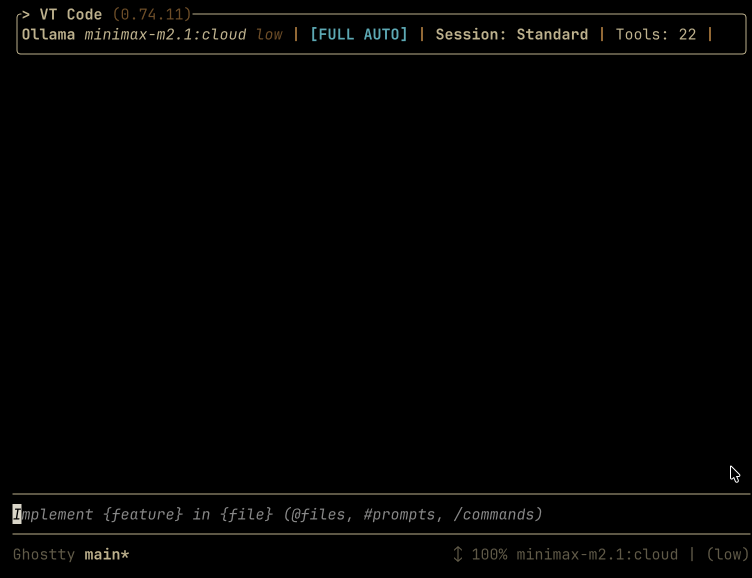

# tui-shimmer

[](https://crates.io/crates/tui-shimmer)
[](https://docs.rs/tui-shimmer/latest/tui_shimmer/)
[](LICENSE)

A shimmer text effect for [Ratatui](https://ratatui.rs/) terminal UIs.



> Used in [VT Code](https://github.com/vinhnx/vtcode) for animated loading states.

Part of the [Ratatui](https://ratatui.rs/) ecosystem -- see
[awesome-ratatui](https://github.com/ratatui/awesome-ratatui) for more
community widgets and tools.

---

## Quick Start

```toml
[dependencies]
tui-shimmer = "0.1"
```

**Minimal integration** -- call `shimmer_spans_with_style` inside your draw loop:

```rust
use ratatui::style::{Color, Style};
use tui_shimmer::shimmer_spans_with_style;

fn draw_loading(f: &mut ratatui::Frame, area: ratatui::layout::Rect) {
    let spans = shimmer_spans_with_style("Loading...", Style::default().fg(Color::Cyan));
    let paragraph = ratatui::widgets::Paragraph::new(spans);
    f.render_widget(paragraph, area);
}
```

The shimmer phase is driven by an internal monotonic clock. The effect sweeps
left-to-right every 2 seconds and loops automatically.

---

## API

| Function                                                     | Use when                                                                             |
| ------------------------------------------------------------ | ------------------------------------------------------------------------------------ |
| `shimmer_spans_with_style(text, base_style)`                 | Default. Phase derived from elapsed time.                                            |
| `shimmer_spans_with_style_at_phase(text, base_style, phase)` | You control timing externally (game loop, manual tick, etc.). `phase` is `0.0..1.0`. |

Both return `Vec<Span<'static>>` -- render it directly in a `Paragraph` or
compose with other `Line`/`Text` content.

### Choosing a phase source

```rust
// -- self-timed, zero setup
shimmer_spans_with_style

// -- use when your app already has a frame clock
// (avoids double-elapsed-time drift under load)
shimmer_spans_with_style_at_phase
```

---

## Full Example

```rust
use crossterm::{
    event::{self, DisableMouseCapture, EnableMouseCapture, Event, KeyCode},
    execute,
    terminal::{disable_raw_mode, enable_raw_mode, EnterAlternateScreen, LeaveAlternateScreen},
};
use ratatui::{
    backend::CrosstermBackend,
    layout::{Constraint, Direction, Layout},
    style::{Color, Style},
    widgets::{Block, Paragraph},
    Terminal,
};
use std::{
    io::{self, stdout},
    time::{Duration, Instant},
};
use tui_shimmer::shimmer_spans_with_style_at_phase;

fn main() -> io::Result<()> {
    enable_raw_mode()?;
    let mut stdout = stdout();
    execute!(stdout, EnterAlternateScreen, EnableMouseCapture)?;
    let mut terminal = Terminal::new(CrosstermBackend::new(stdout))?;

    let start = Instant::now();
    loop {
        let phase = (start.elapsed().as_secs_f32() / 2.0).rem_euclid(1.0);
        terminal.draw(|f| {
            let area = Layout::default()
                .direction(Direction::Vertical)
                .constraints([Constraint::Percentage(100)])
                .split(f.size())[0];

            let spans = shimmer_spans_with_style_at_phase(
                "Welcome to tui-shimmer!",
                Style::default().fg(Color::Cyan),
                phase,
            );
            let paragraph = Paragraph::new(spans)
                .block(Block::bordered().title("Demo"))
                .centered();
            f.render_widget(paragraph, area);
        })?;

        if event::poll(Duration::from_millis(16))?
            && matches!(event::read()?, Event::Key(k) if matches!(k.code, KeyCode::Char('q') | KeyCode::Esc))
        {
            break;
        }
    }

    disable_raw_mode()?;
    execute!(
        terminal.backend_mut(),
        LeaveAlternateScreen,
        DisableMouseCapture
    )?;
    terminal.show_cursor()?;
    Ok(())
}
```

---

## Terminal Compatibility

- **True-color terminals** (most modern terminals): full RGB shimmer blend.
- **256-color / 16-color terminals**: automatic fallback to bold/grey ramp.
- Respects the [NO_COLOR](https://no-color.org/) and `CLICOLOR`/`CLICOLOR_FORCE` environment variables.

---

## License

MIT
